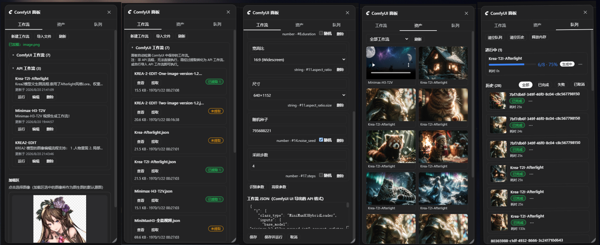

# dsh-comfyui

**English** | [中文](README.md)

<p align="center">
  
</p>

<h1 align="center">dsh-comfyui</h1>

<p align="center">Let the DeepSeek Harness agent smartly drive a local or remote ComfyUI to generate anything — with workflow and asset management panels, per-workflow skill packs, a companion skill and a same-origin media proxy.</p>

<p align="center">
  <a href="https://www.npmjs.com/package/dsh-comfyui"></a>
  <a href="https://www.npmjs.com/package/dsh-comfyui"></a>
  
</p>

> **Requires DeepSeek Harness >= 0.1.2-alpha.4.** From 0.4.0 this plugin uses the new settings service API; on older dsh versions stay on the 0.3.x line.

## Features

### Agent tools

The agent drives ComfyUI directly, no canvas work needed:

- `comfyui_run` — submit an API-format workflow or a built-in template (`txt2img` / `img2img` / `video`) and get media back; `mode: "sync"` waits for the result, `mode: "async"` runs a background job (recommended for video).
- `comfyui_object_info` — list the node definitions your ComfyUI server supports, so the agent can build valid workflows on the fly.
- `comfyui_workflow` — manage the plugin's runnable-workflow library: `list` (server address, local ComfyUI dirs, load-area media, per-workflow parameter lists), `run` (by id + parameter overrides), `skill` (on-demand read of a workflow's skill pack), `refresh` (re-derive a parameter snapshot).
- `comfyui_skill` — read and write workflow skill packs (`list` / `read` / `write` / `append` / `mkdir` / `rename` / `delete` / `enable` / `require`); the agent can write its lessons back into a pack and reuse them across sessions.

### UI panel

A right-docked panel with three tabs:

- **Workflows** — the runnable workflow library (create / edit / run / delete / import `.json`, tag classification with a dropdown filter); auto-detects graphs saved on the ComfyUI server and can **extract** them into runnable workflows (whole / per component / main flow only when a canvas holds several independent flows).
- **Assets** — every generated result with preview, download, and hover-to-delete (also removes the file from the ComfyUI output directory).
- **Queue** — live queue plus full history in five states, with delete / interrupt / rerun / clear / free-memory actions; plugin-submitted jobs show a progress bar and preview.

<p align="center"></p>

### Load area (media loader)

A media loader at the top of the Workflows tab, in the style of ComfyUI's LoadImage node: visual picking (with in-place playback for video/audio), paste/upload, and multiple slots. Filled slots fill the workflow's unset loader parameters in order — **the agent doesn't need to guess file names**; unset `width`/`height` auto-match the source image's size. Uploads are renamed by content hash (dedup).

The `loadArea` field of `comfyui_workflow list` exposes the slots and their contents to the agent.

### Workflow skill packs (a manual for the agent)

A parameter list tells the agent which knobs exist, not what the workflow is *for* or which step goes wrong. A complex workflow can carry a **skill pack** (enable it from the "Skill pack" button on the workflow card):

```
<data dir>/skills/<workflow>/
  SKILL.md          # main doc: when to use / key parameters / gotchas
  references/       # reference docs: style catalogs, troubleshooting
  assets/           # reference images etc (previewable in the panel)
```

- **Progressive disclosure, no resident context cost**: `comfyui_workflow list` shows one summary line → `action: skill` fetches the SKILL.md body once the workflow is chosen → a referenced document is read only when the body points at it. Dozens of workflows can carry full packs, and the daily context cost stays one line each.
- **Edited in the panel**: file list + editor, import (auto-bucketed by extension), custom subdirectories, image preview, and the whole pack root can be moved to another drive / a synced folder (the `技能包目录` setting).
- **The agent can write it too**: the `comfyui_skill` tool lets the agent read and author a pack — `append` a pitfall to SKILL.md and the next session (even another one) reuses that experience.
- **Read-before-run**: a "required" flag makes `run` refuse until the skill pack has been read in this session, with an error pointing to `action: skill`.

### Media proxy & settings

Generated files are served through a same-origin route (`/comfyui/media`) addressed by file name, independent of ComfyUI's in-memory history — old results keep opening after a restart or a history clear. The browser never touches ComfyUI directly: no CORS, no mixed content, and the API key never leaves the host.

The DH settings page gets a "ComfyUI" section: server address, API key env var name, local ComfyUI directories, media host, connection test and a zh/en UI language switch — applied immediately, no `cordis.yml` edits needed.

## Install

```sh
# web profile
dsh plugin --profile web add dsh-comfyui
# desktop profile
dsh plugin --profile desktop add dsh-comfyui
```

After restarting the app: a panel entry appears in the sidebar, a "ComfyUI" section in settings, and the agent gets all tools plus the companion skill right away.

## Usage

Just tell the agent, e.g.:

- "Draw a red cat with ComfyUI"
- "Turn this image into cyberpunk style"
- "Turn the anime image in the load area into a photorealistic portrait, same resolution"
- "Generate a 5-second clip: city at sunset"
- "Run my Krea-Afterlight saved in ComfyUI" (if the graph isn't extracted yet, the agent will ask you to **extract** it in the panel first)

For a remote ComfyUI behind an authenticated proxy, provide the key via credential storage or the `apiKeyEnv` env var (default `COMFYUI_API_KEY`) — it is resolved on the host and never sent to the browser.

## Configuration

`comfyui` section of `cordis.yml` (most is editable in the settings page):

| Key | Default | Description |
| --- | --- | --- |
| `baseUrl` | `http://127.0.0.1:8188` | ComfyUI server address |
| `apiKeyEnv` | `COMFYUI_API_KEY` | Optional API key env var / credential name |
| `dataDir` | *(DSH data dir)* | Where the workflow library and asset index live |
| `comfyuiDirs` | `[]` | Local ComfyUI install dirs (multiple allowed); the agent locates models, custom nodes, TTS voice libraries through these |
| `outputDir` | `''` (inferred) | ComfyUI output dir (used to locate files when deleting assets) |
| `mediaHost` | `''` (auto) | External base URL for generated media |
| `skillsDir` | `''` (default `dataDir/skills`) | Skill pack root (absolute path; a synced folder or VCS works) |

## Requirements

- DeepSeek Harness (`web` / `desktop` profile)
- A running [ComfyUI](https://github.com/comfystack/ComfyUI) server (default `http://127.0.0.1:8188`)
- The `video` template needs [ComfyUI-WanVideoWrapper](https://github.com/kijai/ComfyUI-WanVideoWrapper) and Wan 2.1 models

## License

MIT