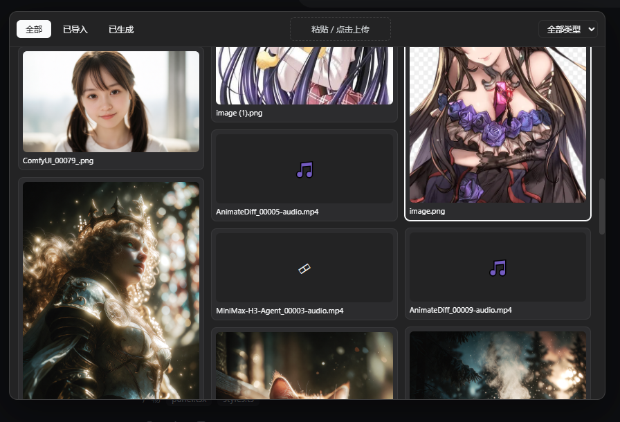
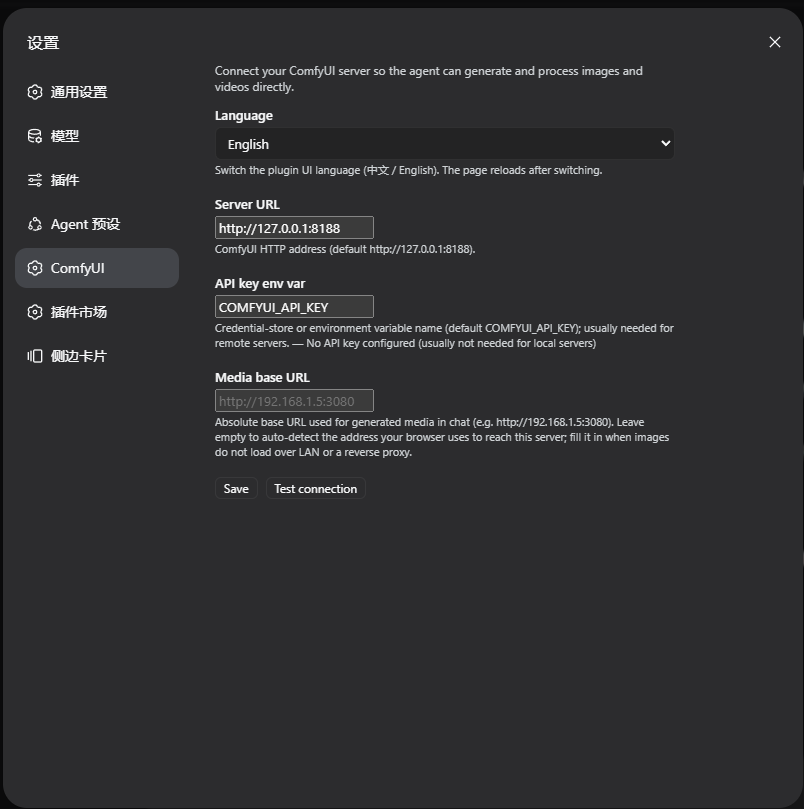

# dsh-comfyui

**English** | [中文](README.md)

<p align="center">
  
</p>

<h1 align="center">dsh-comfyui</h1>

<p align="center">Let the DeepSeek Harness agent drive your ComfyUI server directly to generate and process images and videos.</p>

<p align="center">
  <a href="https://www.npmjs.com/package/dsh-comfyui"></a>
  <a href="https://www.npmjs.com/package/dsh-comfyui"></a>
  
</p>

## Features

### Agent tools

- `comfyui_run` — submit a ComfyUI API-format workflow, or pick a built-in template, and get the generated media back. Two modes: `sync` (wait and return media) and `async` (start a background job, collect with `job_output` — ideal for video).
- `comfyui_object_info` — list the node definitions of your ComfyUI server so the agent can build valid workflows on the fly.
- `comfyui_workflow` — list and run runnable workflows from the plugin library. `action: list` also reports graph workflows you saved on the ComfyUI server and whether each has been **extracted** into runnable workflows; unextracted graphs are flagged so the agent tells you to extract them in the panel first.

### UI panel

Right-docked; open from the sidebar rail — three tabs:

- **Workflows** — the plugin library of runnable (API) workflows: create / edit / run / delete, plus "Import file" to load an API-format `.json` directly. The **ComfyUI-saved graphs** section auto-detects graph workflows you saved in ComfyUI, shows which runnable workflows were extracted from each, and offers **extract** with per-graph analysis: a canvas often holds several independent flows, so you choose extract all / extract per component / extract main flow only. Workflows can be classified with **tags** (see below).
- **Assets** — everything the plugin generated, newest first, with a detail view and download links. Hovering a card reveals a red trash button; it opens a confirmation dialog listing the files, and confirming removes the index record and deletes the matching files from the ComfyUI output directory. ComfyUI itself has no API for deleting output files, so the plugin touches the filesystem directly: files are only really deleted when DSH can reach that directory (same-machine installs); otherwise just the record goes and the dialog says so.
- **Queue** — a task center over ComfyUI's unified jobs API (`/api/jobs`): every task across the live queue **and** history in five states (pending / in progress / completed / failed / cancelled), filterable by state, with per-task progress bars (plugin-submitted jobs), preview thumbnails, failure messages and duration, plus actions — delete, interrupt, rerun, clear queue/history, free memory. Tasks the plugin queued are marked with their workflow name.

<p align="center"></p>

### Load area

A media loader in the style of ComfyUI's LoadImage node, sitting at the top of the Workflows tab: besides images, the picker also lists the video and audio files available to the ComfyUI loader nodes (LoadVideo / LoadAudio).

- **Multiple slots**: the load area is a list of slots — a lone slot stretches across the panel, two or more share a fixed width and wrap into rows. "+ Add slot" at the bottom appends one; an empty slot reads "Slot N / Add media" and fills on click; hovering a slot reveals an **×** in its corner that deletes it, and the picker's first tile ("None") empties a slot while keeping it. Filled slots fill the workflow's unset loader parameters in order — a two-reference workflow just needs two slots, with no file names for the agent to guess.
- Clicking any slot opens a picker window with a nav bar (All / Imported / Generated), a type filter, a paste/upload drop zone on the right, and a masonry grid of every loadable image / video / audio file in the ComfyUI `input` directory plus everything the plugin generated. **Video and audio play right in the card** (clicking the player only plays, it never selects); clicking the file name under a card picks it and closes the window. File kind is decided by extension, and each loader's input key is read from the ComfyUI node definition (`LoadImage.image` / `LoadVideo.file` / `LoadAudio.audio`), so no media type goes missing.
- Load-area media are the **default inputs**: unset loader parameters are filled from the slots in order (slot 1 → first image parameter, slot 2 → second; video/audio parameters take slots of their own kind) — the agent does not need to name a file. Parameters with no matching slot keep the workflow's authored value.
- **Visible to the agent**: `comfyui_workflow action: list` reports a `loadArea` field (slot count, how many are filled, and the file list), so the agent knows what the user loaded without asking.
- **Resolution auto-match**: uploads record their pixel size; when a run leaves `width`/`height` unset, they default to the source image's actual size.
- **Hash naming + dedup**: uploads are renamed to `original_shorthash.ext` (SHA-256 first 10 hex); re-uploading an identical file reuses the existing name instead of storing a duplicate. The picker refreshes live after uploads.
- Selecting a **generated** image copies it from the output directory into `input` on the fly, so image-loading nodes can use it.

<p align="center"></p>

### Workflow tags

Classify runnable workflows with preset categories (image-to-image / text-to-image / text-to-video / image-to-video / reference-to-video / text-to-audio / reference-to-audio) plus any custom tags. Tags are edited in the workflow editor, shown on the top-right of each card, and the library list has a filter bar with per-tag counts.

### Built-in templates

`txt2img` (SDXL text-to-image), `img2img` (SDXL image-to-image), `video` (Wan 2.1 text-to-video via ComfyUI-WanVideoWrapper). Template node ids are documented in the tool description so the agent overrides the right inputs.

### Media proxy

Generated files are addressed by `filename + subfolder + type` and stream through a same-origin route (`/comfyui/media`), never through ComfyUI's in-memory history — older results in the asset panel keep opening after a ComfyUI restart or a history clear, as long as the file is still in the output directory. The browser never talks to ComfyUI directly: no CORS, no mixed-content, no API key in the page, and remote ComfyUI installs work unchanged. The media URL base is auto-detected: on every page load the browser self-reports the origin it actually uses via `/comfyui/ping` (LAN IP / domain / reverse proxy all produce working links), or you can pin it explicitly with the `mediaHost` config key.

### Tool card

Results render as a media wall (images/videos with download links) right in the chat, including background-job status.

### Settings page

A ComfyUI section in the DH settings where you can edit the server URL (`baseUrl`), API-key env var (`apiKeyEnv`), media base URL (`mediaHost`), test the connection, and switch the plugin UI language (Chinese / English — stored in the browser, applies to the whole plugin UI), all without touching `cordis.yml`. The data directory and asset cap are configured in `cordis.yml` only and are not exposed in the settings page.

<p align="center"></p>

### Companion skill

A runtime skill (`dsh-comfyui-workflows`) registered through `ctx.skills.register`: the agent learns the graph-vs-runnable model, canvas analysis rules (connected components, bypassed groups, dangling nodes), when to ask you about extract mode, and the extraction tech rules.

### Graph workflows vs runnable workflows

ComfyUI works in two layers:

- **Graph workflow** — the UI graph you save in ComfyUI (nodes/links/widgets). It is a source, not directly runnable, and a single canvas is often a **test bench holding several independent flows at once**. Visual `groups` are just rectangles — the real executable unit is a **connected component** over the links, with bypassed (`mode 4`) and dangling nodes excluded.
- **Runnable workflow** — an API-format prompt, the actual execution unit. You get one by **extracting** it from a graph (1 graph → N runnable workflows) or by pasting/importing an API `.json` directly.

The **extract** flow analyzes the canvas first (components with their node counts and group membership, bypassed/dangling counts) and lets you pick:

- **Extract all** — merge every component into one runnable workflow (everything executes together).
- **Extract per component** (recommended) — one runnable workflow per independent flow.
- **Extract main flow only** — the largest component only (usually the flow under test).

Extraction follows the live `/object_info`: rewires Reroute/bypass pass-throughs, maps widget values (including dynamic sub-widgets and `control_after_generate`), inlines primitives, drops stale slot references with a warning, skips components with no output node, and fails loudly when a required input was never wired — every extracted workflow is validated by `POST /prompt` (zero `node_errors`) before it is stored.

### Adjustable parameters

Every runnable workflow carries an adjustable **parameter set** (`parameters`) so one workflow can produce different results per run:

- **Auto-detected (conservative)**: prompt text inputs, resolution (`EmptyLatentImage` width/height), sampler steps (`KSampler.steps`), and seed (`KSampler.seed`, randomized per run by default). Sampling-related inputs (cfg/denoise) and model selections stay as authored.
- **Advanced parameters**: the panel's workflow editor can expose any node input as a custom parameter (pick node → pick input → name it), and edit each parameter's name, label, default, and random toggle. The list offers every widget value of the node (a loader's `upload` entry included); inputs currently driven by a link are left out, since they carry no editable value and exposing one would only fight the connection.
- **Boolean parameters use a checkbox**: pick `true` / `false` directly; at run time the `"true"` / `"false"` / `0` / `1` spellings are accepted too (defaults stored as strings by older versions are normalized instead of being silently dropped).
- **Int vs. float number parameters**: the declared input type (`INT` / `FLOAT`) is read from the ComfyUI node definition, so FLOAT inputs like `cfg` or `denoise` accept decimals while INT inputs like `steps` or `seed` are rounded at run time; unknown types are treated as decimals. Each row shows `number/int` or `number/float`, with range and step in the tooltip.
- **Agent-facing**: the parameter list is written into the workflow's input notes (`inputs` field) and shown by `comfyui_workflow` `action: list`; `action: run` accepts `parameters: {"prompt": "...", "seed": 42}` overrides — explicit values win over random/default, omitted parameters use their defaults.
- **Load-area integration**: an unset image-type parameter is filled with the load-area's current source image, and unset `width`/`height` are auto-matched to that image's recorded pixel size. Explicit values always win, so the agent can still override both.

## Requirements

- DeepSeek Harness (web / desktop profile) — the plugin targets the `web` and `desktop` profiles (web side requires `@deepseek-ai/dsh-web-app` ≥ 0.1.0-rc.6).
- A running [ComfyUI](https://github.com/comfystack/ComfyUI) server (default `http://127.0.0.1:8188`).
- For the `video` template: the [ComfyUI-WanVideoWrapper](https://github.com/kijai/ComfyUI-WanVideoWrapper) custom nodes and Wan 2.1 model files.

## Installation

Web profile:

```sh
dsh plugin --profile web add dsh-comfyui
```

Desktop profile:

```sh
dsh plugin --profile desktop add dsh-comfyui
```

Then restart the corresponding app (web server or desktop app; host-side rows mount at boot). The panel trigger appears in the sidebar rail, the settings section "ComfyUI" appears in the settings page, and the agent gains `comfyui_run`, `comfyui_object_info`, `comfyui_workflow`, and the `dsh-comfyui-workflows` skill immediately.

### API key (remote servers)

For a remote ComfyUI behind an authenticating proxy, provide the key through the credentials store or an environment variable named by `apiKeyEnv` (default `COMFYUI_API_KEY`). The key is resolved per request on the host and never sent to the browser.

## Usage

Ask the agent, e.g.:

- "Generate a red cat image with ComfyUI"
- "Turn this image into cyberpunk style" (img2img with an input image filename)
- "Turn the anime girl in the load area into a realistic photo, matching the original resolution" (load-area source image + resolution auto-match)
- "Generate a 5-second clip of a city at sunset" (video; needs the Wan wrapper)
- "Run my Krea-Afterlight workflow saved in ComfyUI" — the agent lists server-side graphs; if yours is not extracted yet it will tell you to click **extract** in the panel first (a canvas may contain several independent flows, so you can extract all as one, per component, or the main flow only).

The agent picks a template, inspects your server with `comfyui_object_info`, or runs a library workflow with `comfyui_workflow`.

### Configuration

The plugin reads a `comfyui` section from `cordis.yml` (or the settings page):

```yaml
# cordis.yml
- id: comfyui
  name: dsh-comfyui
  config:
    baseUrl: http://127.0.0.1:8188
    apiKeyEnv: COMFYUI_API_KEY
    timeoutMs: 900000
    maxMediaItems: 12
    dataDir: ''
    maxAssets: 200
    mediaHost: ''
    outputDir: ''
```

| Key | Default | Description |
| --- | --- | --- |
| `baseUrl` | `http://127.0.0.1:8188` | ComfyUI HTTP server base URL |
| `apiKeyEnv` | `COMFYUI_API_KEY` | Env-variable / credential name for the optional API key |
| `connectTimeoutMs` | `10000` | Per-request connect/read timeout |
| `timeoutMs` | `900000` | Sync generation wait budget (15 min; raise for video) |
| `pollIntervalMs` | `1000` | History polling interval while waiting |
| `maxMediaItems` | `12` | Max media items returned per workflow |
| `maxMediaBytes` | `67108864` | Max bytes the media proxy streams per file |
| `dataDir` | *(DSH data dir)* | Where the workflow library and asset index live (`$DSH_HOME/data/dsh-comfyui` by default) |
| `maxAssets` | `200` | Max entries kept in the asset index |
| `mediaHost` | `''` (auto-detect) | External base URL for generated media (e.g. `http://192.168.1.5:3080`); empty auto-uses the origin the browser actually reaches this server with |
| `outputDir` | `''` (inferred) | ComfyUI's output directory on this machine, used to locate files when deleting an asset; empty infers it from the paths ComfyUI reports, and deletion falls back to removing the index record when it cannot (e.g. a remote ComfyUI) |

## Roadmap & design boundaries

Confirmed scope decisions for this phase:

- **Image-to-video / reference-to-video / audio variants** are not plugin-side features: they share the same upload node as image-to-image, so any such workflow (extracted or imported) works as-is. Add the workflow, not plugin code.
- **No front-end parameter presets/favorites.** Advanced customization happens in the workflow editor (edit parameter defaults, or add an advanced parameter for any node input). This keeps one source of truth.
- **Model-strength knobs** (e.g. `ref_boost`) are handled through the advanced-parameter mechanism: expose the node input, label its effect, and the agent can tune it per run.
- **Planned**: auto-commit of run parameters — after a successful run, save the used parameter values as that workflow's new defaults, so the next run opens with the previous session's values instead of the authored ones.

## Security

- The tools only ever connect to the **configured** `baseUrl` — the agent cannot name arbitrary targets (SSRF containment).
- The API key lives on the host (credentials store / environment), resolved per request; `/comfyui/config` reports only `hasApiKey`.
- Media is capped by size; config writes require same-origin requests.
- Workflows extracted from ComfyUI are validated (non-empty `class_type`, object inputs, zero `node_errors` on the server) before they are stored.
- Headless profiles without a web server keep the tools and skip the routes silently.

## Architecture

A single npm package with two halves, following the DH plugin conventions:

- `src/index.ts` — host entry: `inject: ['tools']`; registers the tools and the companion skill (`ctx.skills.register`, optional service), and mounts routes + media proxy on a `webServer` sub-fiber (`ctx.inject`) so concurrent entry settling can never skip the mounts.
- `src/comfyui.ts` — minimal ComfyUI HTTP client (queue prompt, poll history, object_info, system_stats, interrupt, view download, userdata list/read).
- `src/analyze.ts` — canvas analysis: connected components over active nodes, group membership, dangling/isolated nodes, bypassed counts.
- `src/convert.ts` — graph → API extraction: rewires links (Reroute / bypass pass-through), derives widget order from the graph's own input array plus object_info (including `control_after_generate` and dynamic sub-widgets), inlines primitive values, drops stale slot references with a warning, and fails loudly when a required input was never wired.
- `src/skill.ts` — the `dsh-comfyui-workflows` companion skill body.
- `src/params.ts` — parameter application: fills an unset image parameter with the load-area source image, auto-matches `width`/`height` to the source's recorded size, and re-syncs DynamicCombo parent/child pairs.
- `src/store.ts` — the workflow library and asset index on disk (`workflows.json` + `assets.json`), plus the load-area records (`current-image.json`, `media-sizes.json`, `media-hashes.json`).
- `src/queue.ts` — tracks prompts the plugin queued and moves completed ones into the asset index (sweep-on-read, no timers).
- `src/tools.ts` — `ToolDefinition`s registered through `ctx.tools.register`; results carry `presentationMeta` so the client card renders from the session log.
- `src/routes.ts` — same-origin HTTP routes for the panel (config, workflows, ComfyUI-side graphs + analyze/extract, assets, queue, run, load area, upload with hash dedup + size recording).
- `src/client/` — browser half: the `shell.overlay` right-docked panel + `sidebar.footer.action` trigger, the `tool.call.toolview` card (key `comfyui_run`), and the `settings.section` page (id `comfyui`).
- `cordis.patch.yml` — the `dsh.bundle.patch` layer that inserts the `comfyui` row into a profile.

## Development

```sh
pnpm install
npm run typecheck   # host + client
npm run build       # tsc (host lib/) + tsdown (client bundle)
npm pack --dry-run  # inspect the publish contents
```

To test against a local profile: `dsh plugin --profile web add <path-to-this-repo>` (pnpm links the directory), restart the web server, and rebuild with `npm run build` after changes.

## License

MIT
